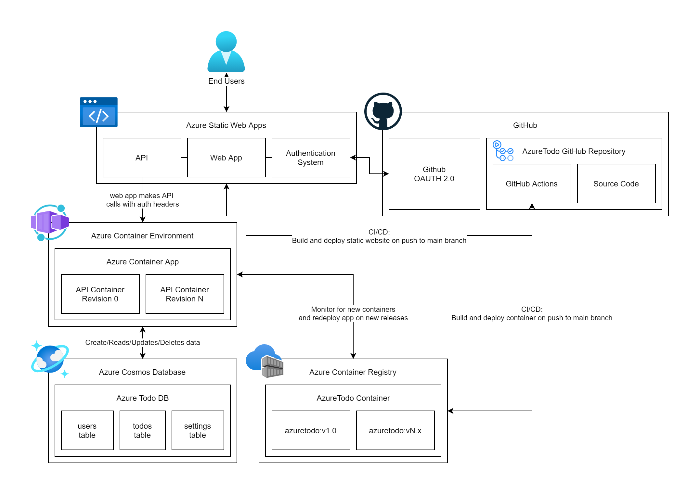

# AzureTodo

a proof of concept todo app using Azure SWA, Container Apps, and Cosmos Database.

## Architecture

This application utilizes both GitHub actions and Azure Cloud for hosting and CI/CD. 

### Azure Static Web Apps

This hosts the static web application (react app using vite: see `/packages/todo-website/`), user authentication system, and as an API proxy to our Azure Container App.

The static web app system seems to put a reverse proxy in-front of the static web app to provide both the authentication layer (`/.auth/**/*` handles sessions, headers, etc.) and the API (`/api/**/*` is routed to the connected backend.) all from the same host. 

For more information on Azure Static Web Apps [see here](/)

### Azure Container App / Azure Container Environment 

This hosts our API (node.js web server using express.js: see `/packages/todo-api`). Azure Container Apps uses Kubernetes and a number of other services under the hood to function. 

The app will scale up/down as needed and can actually scale all the way down to 0 (aka no running app when usage is low over time) to save costs. 

### Azure Container Registry 

This hosts our containers and makes them callable 

### Azure Cosmos Database

This is used to store data for the application in a cost efficient, geographically distributed, and fast. 

## Development

- start the API
  - open `/packages/todo-api/`
  - run `npm run start` to start the server (TODO: dev server via nodemon) 
- start the Website
  - open `/packages/todo-websites`
  - run `npm run azure:dev` to the start the Azure SWA emulator & CLI